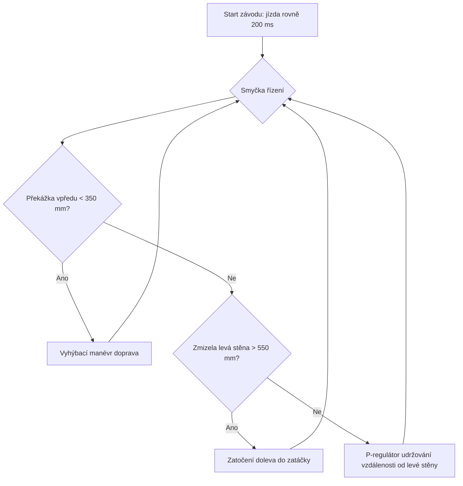

# 🏁 Vítězná strategie pro RoboCarts 2026

Na základě analýzy oficiálních pravidel soutěže **RoboCarts v1** a hardwarové konfigurace robota **LittleFalcon** (přední Lidar, levý Lidar, spodní RGB senzor a gyroskop) navrhuji následující taktiku a způsob řízení.

---

## 📊 Analýza pravidel & vlastností tratě

1. **Směr jízdy:** Podle pravidel se jezdí **proti směru hodinových ručiček (CCW)**.
   * *Důsledek:* Vnitřní stěna (červená) je vždy po **levé straně** robota. Vnější stěna (zelená) je po pravé straně.
2. **Nejkratší trajektorie:** Sledování vnitřní (levé) stěny zaručuje jízdu po nejkratší možné dráze (tzv. "hugging the apex"). To je klíč pro dosažení nejrychlejšího času na kolo.
3. **Kolize se soupeři:** Pravidla povolují běžné kolize se soupeři a mantinely. Startuje se hromadně z boxů.
   * *Důsledek:* Robot musí být robustní vůči nárazům a nesmí zpanikařit, pokud mu v cestě stojí soupeř nebo je vytlačen.

---

## ⚙️ Návrh taktiky: "Sledování levé stěny" (Left Wall-Following)

Tvoje navržená strategie (jezdit podél levé stěny, a jakmile stěna vlevo zmizí, zatočit doleva) je **optimální a matematicky nejvýhodnější**. Zde je detailní rozpad, jak ji implementovat v kódu:

### 1. Stav: Udržování levé stěny (P-regulátor)
* Pokud levý Lidar měří vzdálenost v rozmezí **100 až 450 mm**, robot se nachází v rovince nebo mírné zatáčce podél levé stěny.
* Použijeme jednoduchý proporcionální regulátor (P-regulátor), který porovnává aktuální vzdálenost od levé stěny s požadovanou vzdáleností (např. `požadovaná = 200 mm`).
* **Korekce zatáčení** se spočítá jako: `korekce = (skutečná_vzdálenost - požadovaná) * Kp`.
  * Pokud je moc blízko stěně ➡️ zatočí doprava.
  * Pokud se vzdaluje ➡️ zatočí doleva zpět ke stěně.

### 2. Stav: Detekce zatáčky doleva (Volný prostor vlevo)
* Pokud levý Lidar naměří hodnotu **větší než 550 mm** (nebo nahlásí timeout stěny), znamená to, že levá stěna skončila a nacházíme se na začátku levé zatáčky.
* **Akce:** Robot začne plynule zatáčet doleva s pevným poloměrem (např. `move(-0.6)`), dokud levý dálkoměr opět nezachytí stěnu pod 450 mm. Poté se přepne zpět do režimu udržování stěny.

### 3. Stav: Vyhýbání se překážce vpředu (Kritická priorita)
* Přední Lidar (na servu, namířený rovně) neustále hlídá prostor před robotem.
* Pokud je vzdálenost vpředu **menší než 350 mm** (stěna nebo pomalejší soupeř), má tento stav přednost před vším ostatním.
* **Akce:** Robot prudce zatočí doprava (`move(1.0)`), aby se vyhnul čelnímu nárazu, a sníží rychlost.

### 4. Stav: Start z boxu (Prvních 200 ms)
* Při startu z boxu se přední stěna otevře. Ostatní roboti mohou vyrazit s námi.
* **Akce:** Prvních 200 ms jede robot čistě rovně (s využitím stabilizace gyroskopu), aby vyjel z boxu a nezačal okamžitě korigovat zatáčení podle bočních stěn startovního boxu.

---

## 🛠️ Jak do toho zapojit Gyroskop a RGB senzor

* **Gyroskop (Stabilizace směru):** 
  * Během jízdy rovně (kdy levá stěna je stabilní a před námi nic není) můžeme použít integrovaný úhel z gyroskopu k tomu, aby robot držel perfektní přímý směr a neklikatila se mu dráha.
* **RGB Senzor (Počítání kol):**
  * Spodní RGB senzor neustále hlídá černou cílovou čáru. Podle pravidel je šířka čáry 1,5 až 2 cm.
  * Jakmile senzor detekuje černou, inkrementuje se počet kol. Po dosažení cílového počtu kol robot automaticky zastaví (což je doporučeno v pravidlech pro snadné vyzvednutí).

---

## 💡 Doporučené parametry pro ladění (Tune Parameters)

| Parametr | Doporučená hodnota | Popis |
| :--- | :--- | :--- |
| `TARGET_LEFT_DIST` | **200 mm** | Požadovaná vzdálenost od levé stěny v rovinkách. |
| `LEFT_OPEN_THRESHOLD` | **550 mm** | Vzdálenost, při které považujeme levou stěnu za "zmizelou" (začátek zatáčky). |
| `FRONT_DANGER_DIST` | **350 mm** | Vzdálenost stěny/překážky vpředu pro nouzové vyhnutí doprava. |
| `SPEED_NORMAL` | **270** | Základní rychlost na rovinkách. |
| `SPEED_TURN` | **180** | Snížená rychlost při ostrém zatáčení a vyhýbání. |
